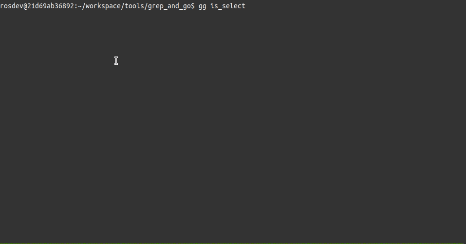

# grep_and_go
Search and navigate to the line right away.



## Requirements
- Python 3
    - curses: This is a built-in module but which is not included in Windows.
        If you are using Windows, you might need to consider using `UniCurses`.
- (search tool) grep
- (pager) less
    > :note: If you want to use an alternative to `grep` or `less`, you might
    > need to revise the command line argument for search in `run.sh`.


## Installation
1. Clone this repository.
2. Create a symlink of `run.sh` to `/usr/local/bin/<EXEC_NAME>`. e.g.,
    ```bash
    # Here we use `gg` as the command alias.
    # Remember to create the symlink of `run.sh` with absolute path
    $ ln -s $(realpath run.sh) /usr/local/bin/gg
    ```
    > :note: Of course, you can install the script `run.sh` to anywhere you prefer.
    > Just make sure you can run it conveniently.


## Usage
- Run `<EXEC_NAME>` with a pattern string you want to search under a folder, e.g.,
    ```bash
    $ gg foobar
    ```
- Since we use `less` as a pager by default, you can press key "Enter" or "e" to open
    the file and navigate to the line you selected. The only difference is, you can
    continue exploring the search result by pressing "q" after if you use key "e" to
    navigate to the line.


## Troubleshooting
- If the layout of shell prompt (known as `$PS1`) in your terminal got messed up
    after some strange operations, you can run `reset` to restore it to the
    original state.


## Thanks
Besides any `grep`-like tools, this application is mainly developed based on
[`sdt/uselect`](https://github.com/sdt/uselect).
